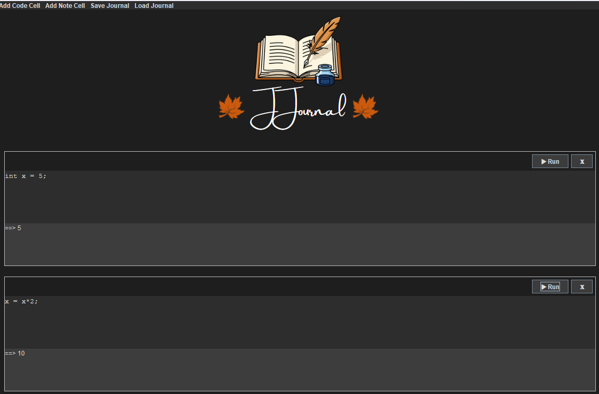

<div align="center">

 JJournal
===
[](./LICENSE) [](https://github.com/dug22/JJournal/stargazers) [](https://github.com/dug22/JJournal/releases)[](#)

</div>

## Overview
JJournal is a desktop based notebook software that allow users to write and execute Java code. JJournal leverages JShell's API, making it possible
to interactively run code snippets, visualize outputs, and document workflows with in a single, user-friendly ecosystem. With JJournal you never have to lose your progress,
as JJournal allows you to save your notebook's work and  load it back up to work on later. JJournal utilizes GSON to save and load notebook components
(including cells and their content). Give JJournal a try if your work primarily revolves around simple code testing, analysis, and more.



## Getting Started

```JJournal``` requires Java 23 or higher.

```JJournal``` is distributed as Jar and can be downloaded from the repository's releases tab. B

```
curl -LO https://github.com/dug22/JJournal/releases/download/{version}/JJournal.jar
```

Then to launch the software:

```
java -jar JJournal.jar 
```

### Initial Setup
You will be prompted with this upon launch:
```txt
Before using JJournal we require that you provide a file of your all Class Paths
If you do not have a text file of your class paths create one!
The format of your file should look like this:
 \\path\\to\\jar1.jar
 \\path\\to\\jar2.jar
Type done if you wish to continue without using any third party libraries
```
Optionally, you can provide a text file of class paths you wish to use (you can skip this part by typing 'done'). Class paths are the dependencies you wish to use upon launch. Class
paths must all point to the jar files of the dependencies you wish to use. Most of them may be in your .m2/repository folder, if you use Maven. An ideal class-paths.txt text file would end up looking something like this.

```txt
C:\\Users\\user\\.m2\\repository\\io\\github\\dug22\\carpentry\\1.0.7.5\\carpentry-1.0.7.5.jar
C:\\Users\\user\\.m2\\repository\\com\\google\\code\\gson\\gson\\2.13.2\\gson-2.13.2.jar"
```

Once you have a ```class-paths.txt``` file typed out, just provide the path in your terminal.

```text
D:\JJournal\class-paths.txt
```

After providing the appropriate file path, JJournal will then launch. Enjoy!

### Automation Script
Here is a shell script to automate these tasks. Make modifications to the script that best meet your needs.

```
java -jar JJournal.jar
\path\to\class-paths.txt
```

## License
JJournal is released under the MIT license [MIT License](https://github.com/dug22/Image-Shield/blob/master/LICENSE)
```
MIT License

Copyright (c) 2026 dug22

Permission is hereby granted, free of charge, to any person
obtaining a copy of this software and associateddocumentation
files (the "Software"),to deal in the Software without restriction,
including without limitationthe rights to use, copy, modify, merge,
publish, distribute, sublicense,and/or sell copies of the Software,
and to permit persons to whom the Software is furnished to do so,
subject to the following conditions:

The above copyright notice and this permission notice shall be included
in all copies or substantial portions of the Software.

THE SOFTWARE IS PROVIDED "AS IS", WITHOUT WARRANTY OF ANY KIND, EXPRESS OR
IMPLIED, INCLUDING BUT NOT LIMITED TO THE WARRANTIES OF MERCHANTABILITY,
FITNESS FOR A PARTICULAR PURPOSE AND NONINFRINGEMENT. IN NO EVENT SHALL THE
AUTHORS OR COPYRIGHT HOLDERS BE LIABLE FOR ANY CLAIM, DAMAGES OR OTHER LIABILITY,
WHETHER IN AN ACTION OF CONTRACT, TORT OR OTHERWISE, ARISING FROM, OUT OF OR IN
CONNECTION WITH THE SOFTWARE OR THE USE OR OTHER DEALINGS IN THE SOFTWARE.
```

## Contributions
Contributions are welcome! If you have suggestions, bug fixes, or enhancements, please open an issue to share them.